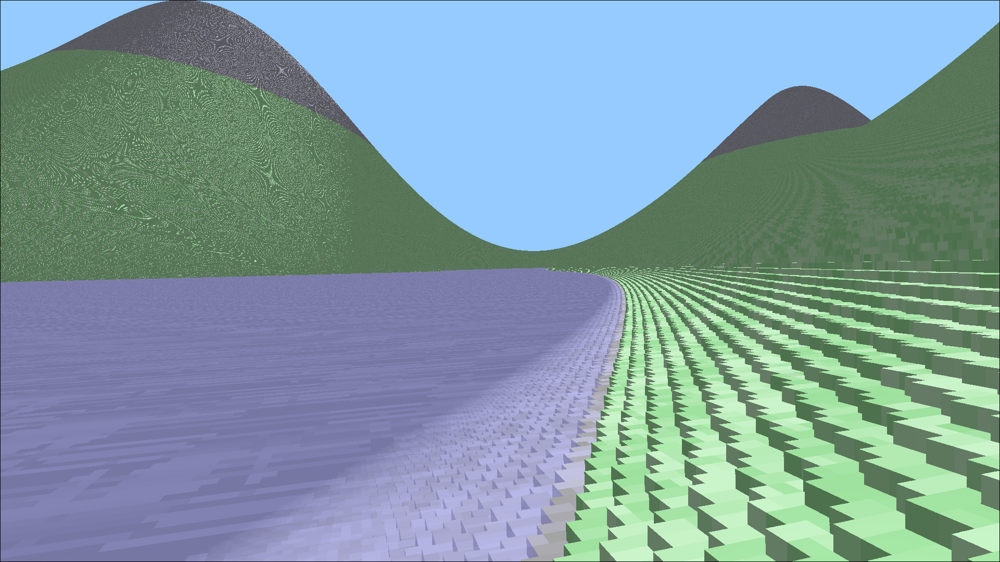

# Voxel Game

except right now it's just a raytraced sparse voxel octree renderer

paper used: https://research.nvidia.com/publication/2010-02_efficient-sparse-voxel-octrees

can render a lot of voxels right now, but a lot of work needs to be done for effects & multiple trees

might take a bit to generate the terrain
